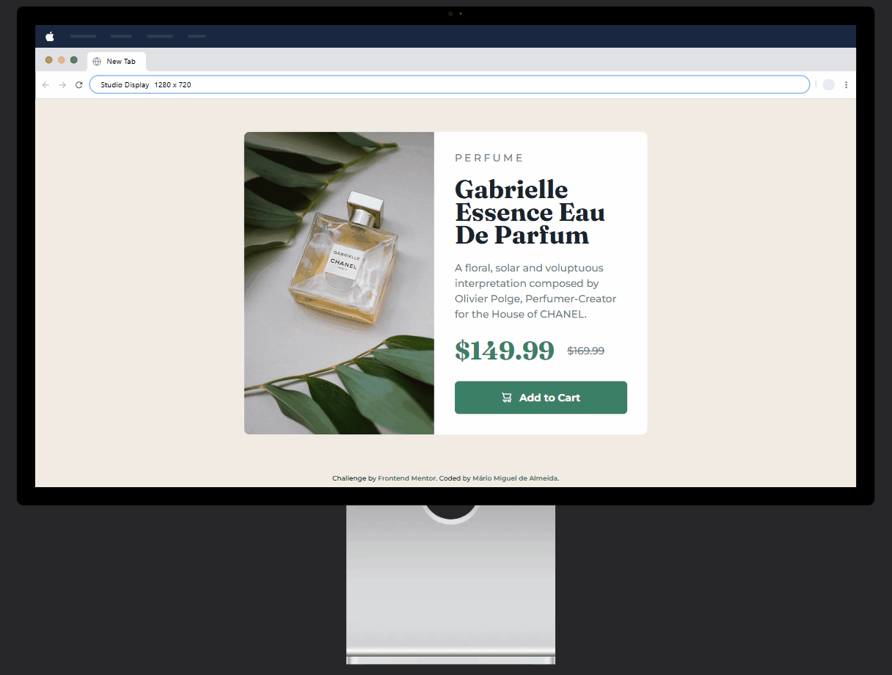
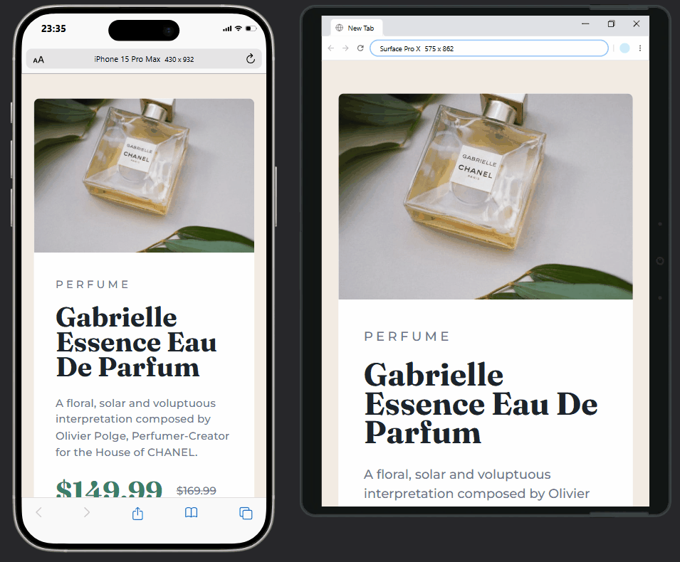

# Product Preview Card Component | Desafio do Frontend Mentor

## __Sumário__

- [Visualização do Projeto](#visualização-do-projeto)
- [Apresentação](#apresentação)
- [Explicação do Projeto](#explicação-do-projeto)
- [Estrutura do Projeto](#estrutura-do-projeto)
- [Como Utilizar o Código do Projeto](#como-utilizar-o-código-do-projeto)
- [Ferramentas e Tecnologias Utilizadas](#ferramentas-e-tecnologias-utilizadas)
- [Principais Recursos e Abordagens](#principais-recursos-e-abordagens)
- [Aprendizado Adquirido](#aprendizado-adquirido)
- [Desenvolvimento Contínuo](#desenvolvimento-contínuo)
- [Agradecimentos e Conclusão](#agradecimentos-e-conclusão)
- [Contato](#contato)
- [Licença de Uso](#licença-de-uso)

## __Visualização do projeto__

### __Desktop:__

<div>
  
</div>

### __Mobile:__

<div>
  
</div>

### [Acesse a página clicando aqui!](https://miguel-dalmeida.github.io/product-preview-card-component/) 


## __Apresentação__  

Olá! Me chamo Mário Miguel e sou estudante de Desenvolvimento Web. Atualmente, faço parte do curso __DevQuest__, da *Dev em Dobro*, focado na formação de desenvolvedores Fullstack.  

Como parte do meu aprendizado, recriei o desafio __*Product Preview Card Component*__ do *Frontend Mentor*. Esse desafio faz parte do meu projeto [__Lapidando HTML e CSS__](https://gigantic-chef-a6f.notion.site/Lapidando-HTML-e-CSS-1a4cd10b93ab8081a48cf19eeef02d02?pvs=73), que criei para aprimorar minhas habilidades práticas em HTML e CSS.  

O projeto consiste em quatro desafios do *Frontend Mentor*, escolhidos a dedo para acompanhar a evolução do meu aprendizado. __A cada novo desafio, o nível de complexidade aumenta, me preparando gradualmente para iniciar meus estudos em JavaScript ao término da lapidação.__

## __Explicação do Projeto__  
O __*Product Preview Card Component*__ é o segundo desafio dos 4 que integram o programa __Lapidando HTML e CSS__. Este desafio tem o objetivo de reforçar o conhecimento em *CSS Flexbox*.  

Trata-se de uma página simples e elegante para a divulgação e compra do perfume __Gabrielle Essence Eau De Parfum__, da marca __Chanel__. A interface é composta por um cartão central, onde:  
- Do lado esquerdo, há uma imagem do perfume.  
- Do lado direito, encontram-se o nome do produto em destaque, uma breve descrição, o preço (incluindo uma promoção) e um botão para adicionar ao carrinho.  

O design da aplicação segue uma estética minimalista, com uma paleta de cores em tons de bege, branco e verde, que se assemelham às cores da imagem do perfume.  

__Atenção:__ se quiser praticar HTML e CSS, você pode codificar esse projeto também! Basta acessar o link abaixo para conferir o desafio no *Frontend Mentor*:  
🔗 [Product Preview Card Component](https://www.frontendmentor.io/challenges/product-preview-card-component-GO7UmttRfa)

## __Estrutura do Projeto__

```
├── src/
│   ├── css/
│   │   ├── reset.css
│   │   ├── variables.css
│   │   ├── styles.css
│   │   ├── responsive.css
│   ├── images/
│   │   ├── image-product-mobile.jpg
│   │   ├── image-product-desktop.jpg
│   │   ├── icon-cart.svg
│   │   ├── favicon-32x32.png
│   │   ├── gif_final_page_desktop.gif
│   │   ├── gif_final_page_mobile.gif
│   │   ├── devquest_dev_em_dobro_logo.jpg
├── index.html
├── README.md

```

## __Como Utilizar o Código do Projeto__

__Para rodar este projeto em sua máquina local, siga os passos abaixo:__

### 1️⃣ Crie um diretório para o projeto  
Escolha um local no seu computador e crie uma pasta para armazenar os arquivos do projeto.

### 2️⃣ Acesse o terminal  
Clique com o botão direito sobre a pasta criada e selecione a opção para abrir o terminal.  

### 3️⃣ Clone o repositório  
No terminal, execute o seguinte comando para clonar o repositório:  
```sh
git clone https://github.com/Miguel-dAlmeida/product-preview-card-component.git
```
### 4️⃣ Acesse o diretório do projeto
Após a clonagem, entre na pasta do projeto executando o comando abaixo em seu terminal:

```sh
cd product-preview-card-component
```

### 5️⃣ Abra o projeto no editor de código
Ainda no terminal, caso esteja utilizando o VS Code, basta rodar o comando:

```sh
code .
```
Se estiver utilizando outro editor, abra a pasta `product-preview-card-component` manualmente no programa de sua escolha.

__Pronto! Agora você pode explorar e editar o código do projeto.__ 

## __Ferramentas e Tecnologias Utilizadas__

<div style="display: inline_block" align="center"><br>
  
  
  
</div>

## __Principais Recursos e Abordagens__

- **Tags semânticas**: Utilização de tags semânticas como `<main>`, `<section>` e `<footer>`, entre outras, para garantir uma melhor estruturação do conteúdo e facilitar a acessibilidade e a indexação por mecanismos de busca (SEO).

- **Classes padronizadas:** Estabeleci um padrão rígido e coerente para a nomeação das classes, garantindo que fossem descritivas e atendessem aos princípios do *Clean Code*.

- **Tag `<picture>`**: Implementação da tag `<picture>` para otimizar o carregamento de imagens, permitindo o uso de diferentes formatos e resoluções conforme o tamanho da tela do usuário.

- **Resets CSS**: O uso de um arquivo de *Reset CSS* para normalizar a aparência dos elementos.

- **Variáveis CSS**: Emprego de variáveis CSS para centralizar e padronizar as cores do projeto.

- **Fontes do Google Fonts**: Inclusão das fontes *Montserrat* e *Fraunces*.

- **Unidade de medida relativa (rem)**: Garantia de escalabilidade dentro do projeto (com essa abordagem, um ponto de alteração reflete em toda a página).

- **Pseudo-classes**: Utilização das pseudo-classes `:hover` e `:is`.

- **CSS Flexbox**: Aplicação do *Flexbox* para a disposição e alinhamento de elementos.

- **Proporção Responsiva**: Foi empregada a propriedade `aspect-ratio` para assegurar que certos contêineres ampliem em telas desktop mantendo a proporção `4:3`. Adicionalmente, a utilização do valor `unset` permitiu que esses contêineres previamente configurados com a proporção `4:3` se adaptassem de forma responsiva em dispositivos móveis.

- **Media Queries**: Aplicação de media queries para garantir que o layout se adapte adequadamente a diferentes tamanhos de tela.

- **Responsividade Condicional**: Implementação de media queries com condicionais, como `(orientation: portrait)`, para aplicar estilos específicos conforme a orientação da tela e outras características do dispositivo.

- **Prefixos `-webkit-`, `-ms-` e `-o-`**: Inclusão de prefixos em propriedades CSS para garantir compatibilidade com versões antigas de navegadores.  
*__Nota:__ Utilizei o site [Autoprefixer CSS online](https://autoprefixer.github.io/) para incluir os prefixos automaticamente.*

## __Desafios Enfrentados__

No início, tive dificuldades ao utilizar a tag `<button>`, especialmente em relação aos atributos da `` (imagem do ícone de carrinho), que era um elemento filho do botão. Como a imagem era meramente ilustrativa, fiquei em dúvida sobre o uso do atributo `alt`, já que queria garantir a acessibilidade do botão. Após pesquisas, descobri que a melhor abordagem seria utilizar `aria-hidden="true"`, garantindo que leitores de tela ignorassem a imagem, uma vez que ela não adicionava significado ao conteúdo da aplicação.  

__Responsividade para telas maiores que 1440px:__
Optei por desenvolver o projeto utilizando a metodologia *Desktop First*, inicialmente projetado para telas de **800x600px** (proporção `4:3`). Para manter o alinhamento com o design, defini o contêiner `.product-card` com **largura e altura fixas**, conforme o código abaixo:

```css
.product-card {
    background-color: var(--card-bg-color, hsl(0, 0%, 100%));
    display: flex;
    width: 800px;
    height: 600px;
    border-radius: 10px;
}
```

Porém, ao adaptar o layout para telas maiores, precisei aumentar as dimensões do `.product-card` via **Media Queries**. No entanto, como utilizei largura e altura fixas, acabei **quebrando a proporção original `4:3`**, o que despadronizou o design do cartão.  

A solução veio com a propriedade `aspect-ratio`, que permitiu que o aumento da largura fosse acompanhado proporcionalmente pela altura, mantendo o formato correto:

```css
.product-card {
    background-color: var(--card-bg-color, hsl(0, 0%, 100%));
    max-width: 800px;
    aspect-ratio: 4 / 3;
    display: flex;
    border-radius: 10px;
}
```

Além disso, para tornar o layout **flexível em dispositivos móveis**, utilizei `unset` na propriedade `aspect-ratio` dentro da primeira **Media Query Mobile**, permitindo que `.product-card` se ajustasse automaticamente ao invés de manter-se rígido na proporção `4:3`.

__Sobrescrição de Media Queries:__  
Outro desafio surgiu devido a um entendimento raso sobre o atributo `media` no HTML. Inicialmente, o código abaixo fazia com que o navegador **só carregasse o arquivo `responsive.css` caso a condição da media query fosse atendida**:

```html
<link rel="stylesheet" media="(max-width: 950px) and (orientation: portrait)" href="./src/css/responsive.css">
```

Esse erro fez com que os estilos direcionados a telas maiores **não fossem aplicados corretamente**.  

A solução foi mover a regra `max-width: 950px and orientation: portrait` para dentro do arquivo `responsive.css`, garantindo que o navegador carregasse e aplicasse **todas as Media Queries desde o início**, independentemente do tamanho da tela.

Esses desafios me proporcionaram um aprendizado significativo sobre **acessibilidade, responsividade e boas práticas na organização de Media Queries**.

## __Aprendizado Adquirido__

 ### 1️⃣ Semântica e Acessibilidade

Compreendi melhor o uso da tag `<section>`, entendendo que ela deve ser utilizada para agrupar elementos **autossuficientes**, ou seja, seções com título próprio e que façam sentido isoladamente. Isso me levou a evitar o uso desnecessário dessa tag para envolver apenas uma imagem.  

Também aprendi sobre o atributo `aria-hidden="true"` e sua aplicação para **ocultar elementos irrelevantes para leitores de tela**. Inicialmente, eu havia adicionado um `alt` na imagem do ícone de carrinho (dentro da tag `<button>`), mas ao perceber que se tratava de um **elemento meramente decorativo**, substituí pelo `aria-hidden="true"`, resultando em um código mais limpo.


### 2️⃣ Responsividade e Layout Adaptável  
Descobri a **propriedade `aspect-ratio`** e sua importância na construção de layouts responsivos. Ela me permitiu manter uma proporção específica (`4:3`) para o contêiner `.product-card` conforme suas dimensões eram ajustadas.  

Ademais, durante o intervalo entre a finalização do código e a escrita deste README, aproveitei para estudar as funções **`clamp()`, `min()` e `max()`**. Embora não tenha aplicado esses conceitos neste projeto, eles serão extremamente úteis para futuras implementações de responsividade.


### 3️⃣ Melhor compreensão do atributo `media` no `<link>`  

Aprendi que **condicionar o carregamento do arquivo CSS `responsive.css` diretamente no atributo `media` da tag `<link>`** pode ser problemático. Isso porque, caso a condição da **media query** não seja atendida, o navegador simplesmente **ignora o arquivo `responsive.css`**, impedindo a aplicação dos estilos presentes nele. 

A solução foi garantir que o arquivo `responsive.css` fosse carregado sempre, e então definir as **Media Queries dentro do próprio arquivo**, permitindo que o navegador aplique os estilos dinamicamente conforme necessário.


## __Desenvolvimento Contínuo__  

Com a conclusão deste projeto, sigo para o próximo desafio: __Bento Grid__, também do *Frontend Mentor*. Enquanto a __*Product Preview Card Component*__ teve como foco __CSS Flexbox__, este novo desafio terá como objetivo testar meus conhecimentos em __CSS Grid__.

Faltam apenas dois projetos para eu avançar para o módulo de __JavaScript Básico__. Confesso que o próximo desafio me deixa um pouco apreensivo, pois não me sinto tão confiante em __CSS Grid__. No entanto, fico feliz em saber que, por meio do __Bento Grid__, terei a oportunidade de aprimorar meus conhecimentos nesse conceito.

## __Agradecimentos e Conclusão__

Se você chegou até aqui, meu sincero obrigado por dedicar seu tempo a explorar este projeto e acompanhar minha jornada. Completar esse desafio foi uma grande conquista, e cada passo reforça minha certeza de que estou no caminho certo para conquistar minha primeira vaga como desenvolvedor web júnior.

Também não posso deixar de agradecer ao [**DevQuest**](https://www.youtube.com/@DevemDobro), curso do qual sou aluno, por todo o suporte e conhecimento ensinado ao longo da minha jornada.  

<div align="center">
      <a href="https://www.youtube.com/@DevemDobro">
        
      </a>
</div>
<br>

Um grande abraço e até o próximo projeto. __Bora codar!__

## __Contato__

 <div style="margin-bottom: 20px;">
    <a style="padding-right: 3px;" href="https://www.linkedin.com/in/mariomigueldealmeida/"></a>
    <a href="mailto:mariomigueldealmeida@gmail.com"></a>
  </div>

## __Licença de Uso__  

Este código está disponível exclusivamente para fins educacionais. Qualquer outro tipo de utilização não está autorizada.   

<br>
<div align="center">
  
</div>


